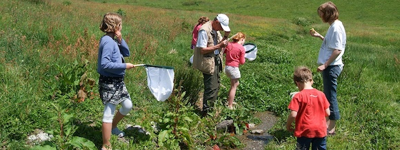

Credit: The Trustees of the Natural History Museum, London

### Initiatives

> [BioComp](http://www.biocomp.org.br) - Research Center on Biodiversity and Computing
> [DataOne](https://www.dataone.org/working_groups/public-participation-science-and-research-working-group) - DataONE Public Participation Science Research Working Group

### References

Data Policies for Public Participation in Scientific Research
DataONE
August, 2013

### Team

- Antonio M. Saraiva (University of São Paulo - Brazil)
- Etienne Cartolno (University of São Paulo - Brazil)
- Libby Ellwood (Florida State University, iDigBio - USA)
- Robert D. Stevenson (UMass Boston - USA)
- Stanley Blum (California Academy of Sciences - USA)
